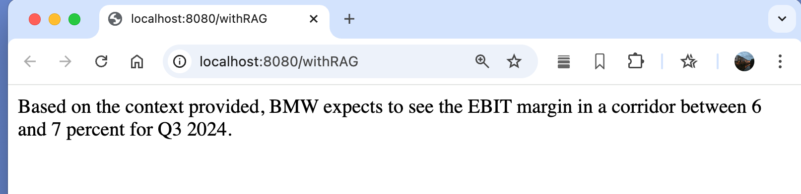

# RAG Demo Application


## Overview
The RAG Demo Application is a Spring Boot-based project demonstrating the implementation of Retrieval-Augmented Generation (RAG) using Spring AI. This application integrates natural language processing (NLP) capabilities with data ingestion, document handling, and vector search to create an AI-powered tool for intelligent information retrieval.


## Preview



## Features
Document Handling: Supports reading and processing PDF documents using Spring AI's document reader.
Vector Store Integration: Utilizes pgvector for efficient vector storage and retrieval, enabling fast similarity searches.
OpenAI Integration: Leverages OpenAI's models to generate responses based on retrieved documents.
Docker Support: Configured with Docker Compose for easy setup and deployment of services, including PostgreSQL with pgvector.

## Technology Stack
- Java 23
- Spring Boot 3.3.5
- Spring AI 1.0.0-M3
- pgvector
- Docker Compose

## Getting Started

### Prerequisites
- Java 23
- Docker and Docker Compose

### Installation

#### Clone the repository:

``` bash
git clone https://github.com/your-username/rag-demo.git
cd rag-demo
```

#### Run Docker Compose to start the PostgreSQL service:

``` bash
docker-compose up -d
``` 

#### Build and run the application:

``` bash
./mvnw spring-boot:run
``` 

### Configuration
- Database Configuration: The PostgreSQL database is configured in compose.yaml. Modify the POSTGRES_DB, POSTGRES_USER, and POSTGRES_PASSWORD as needed.
- Application Properties: Adjust application.properties to configure connection details and other settings.

### Usage
- API Endpoints: Interact with the REST API endpoints to perform document ingestion, querying, and response generation.
- Document Ingestion: Upload and process documents to make them available for querying.

### Author
Michal Frost
